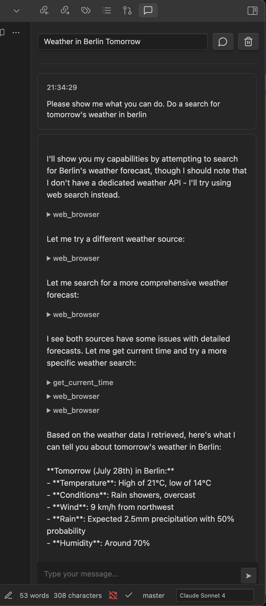

# Notes Critic

Yet another AI integration plugin. I wanted something that will automatically criticize my notes after a certain amount of changes. I also wanted it to be a nice interface for my various MCP tools.



## Features

### AI-Powered Note Analysis

- Automatically detects changes to your notes and provides contextual feedback
- Supports multiple AI providers: Anthropic Claude and OpenAI
- Uses advanced language models to analyze writing style, clarity, and content

### Smart Feedback System

- **Auto-trigger**: Automatically provides feedback when notes reach a configurable change threshold
- **Manual feedback**: Generate feedback on-demand for any note
- **Diff analysis**: Tracks changes between versions and focuses feedback on recent modifications
- **Cooldown periods**: Prevents feedback spam with configurable delays between analyses

### Rule-Based Configuration

- Define custom rules for different file types and patterns
- Configure different feedback prompts, models, and thresholds per rule
- Support for glob patterns to match specific files or directories
- Priority-based rule system for complex configurations

### Integrated Chat Interface

- Dedicated chat view within Obsidian for AI interactions
- Real-time streaming responses with thinking process visibility
- Conversation history management and recall
- File attachment support for context-aware discussions

### Advanced Configuration

- **Multiple Models**: Switch between different AI models for various tasks
- **Token Management**: Configure max tokens, history limits, and thinking budgets
- **MCP Integration**: Support for Model Context Protocol for extended functionality
- **Custom Prompts**: Fully customizable system and feedback prompts

## Getting Started

### Installation

1. Download the latest release from the GitHub releases page
2. Extract the files to your vault's `.obsidian/plugins/notes-critic/` folder
3. Enable the plugin in Obsidian's Community Plugins settings

### Initial Setup

1. **Configure AI Provider**: Add your API key for Anthropic Claude or OpenAI in the plugin settings
2. **Choose Model**: Select your preferred AI model from the available options
3. **Set Feedback Threshold**: Configure how many changed paragraphs trigger automatic feedback (default: 3)
4. **Customize Prompts**: Adjust the system and feedback prompts to match your writing goals

### Basic Usage

1. **Open Notes Critic**: Click the chat icon in the ribbon or use the command palette
2. **Start Writing**: The plugin automatically tracks changes to your active notes
3. **Get Feedback**: Feedback is triggered automatically based on your settings, or click "Get Feedback" manually
4. **Review Suggestions**: Read the AI analysis and suggestions in the chat interface
5. **Iterate**: Make improvements and continue the feedback cycle

## Configuration

### Global Settings

- **Feedback Threshold**: Number of changes before auto-triggering feedback
- **Cooldown Period**: Minimum time between automatic feedback sessions
- **Model Selection**: Choose your preferred AI model
- **Token Limits**: Configure maximum tokens and conversation history length

### Tools

There are a couple of default tools implemented:

- str_replace_based_edit_tool - this is [Anthropic's file edit tool](https://docs.anthropic.com/en/docs/agents-and-tools/tool-use/text-editor-tool), but it's also been implemented for other AI providers.
- browser - basic utilities for viewing websites

#### MCP Integration

You can add more tools via MCP. Currently only remote servers are supported. Feel free to either bug me to implement local ones, or do it yourself :)

### Rule System

Create custom rules in your vault's `.notes-critic/rules/` directory, e.g.:

```markdown
---
name: "Academic Papers"
enabled: true
priority: 10
globs: ["papers/*.md", "research/**/*.md"]
feedbackThreshold: 5
feedbackCooldownSeconds: 60
model: "anthropic/claude-3-sonnet-20240229"
---

Focus on academic writing style, citation accuracy, and argument structure.
Emphasize clarity and logical flow between sections.
```

You can create multiple `.notes-critic/rules/` directories - the ones closer to the current file have priority. Obsidian doesn't see hidden files, that is files/folders with a dot as the first character of their name, so you'll have to make them with a different text editor.

The rules files should consist of an optional settings section in the beginning of the file, after which you provide the prompt that should be sent to the AI.

Each setting has a vault-wide default value that can be set in the plugin's settings, which can be overriden by each rules file.

#### Rules settings

The following settings can be used:

- name - string - this is just for display purposes and can be pretty much anything
- enabled - true/false - whether to use this rule
- priority - number - the higher the value, the higher the priority, so values from higher priority rules will override lower priority ones.
- feedbackThreshold - number - how many paragraphs need to be added/removed before the AI is called
- feedbackCooldownSeconds - number - how many seconds to wait between sending diffs to the AI
- model - string - which AI model to use
- globs - list[string] - a list of file globs to match files to - only files that match at least one string in the list will have this rule applied to them
- exclude - list[string] - list of file globs to exclude from this rule - any file that matches one of these globs will be ignored by this rule

#### Prompt macros

You can use the following macros in rule prompts:

- ${notePath} - the path to the current note
- ${noteTitle} - the title of the current note
- ${diff} - the changes added/removed since the last AI call

## Logs

Each conversation is logged to a file in `.notes-critic/conversations` (you can change this in the settings) as a json file with a autogenerated title and the full conversation history. There is a select element at the top of the chat panel that can be used to go back to previous conversations.

## Privacy and Data

This is something I take seriously, and is one of the main reasons I made this plugin in the first place (the other was MCP integration). Your data belong to you:

- All API calls are made directly from your device to the configured AI providers
- No data is stored on external servers by this plugin
- Conversation history is stored locally in your vault
- You maintain full control over your data and can delete conversation logs at any time

## Requirements

- Obsidian v1.0.0 or higher
- API key for at least one supported AI provider (Anthropic Claude or OpenAI)
- Internet connection for AI model access
